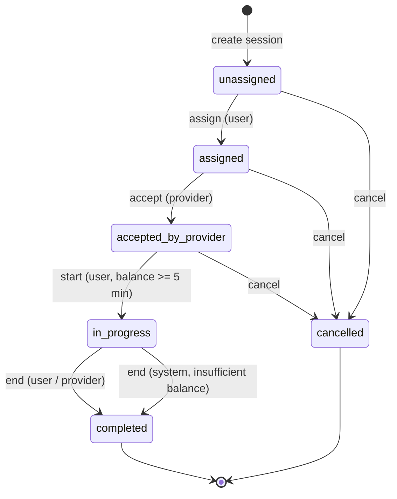
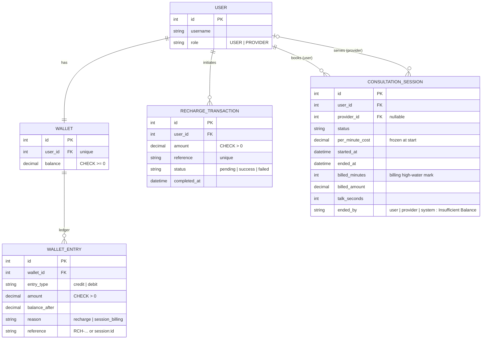

# Diagrams

## Session state machine



Plain-text version:

```
unassigned --assign--> assigned --accept--> accepted_by_provider --start--> in_progress
                                                                               |
                          user end / provider end / system end (no balance) ---+
                                                                               v
                                                                           completed

unassigned | assigned | accepted_by_provider  --cancel-->  cancelled
```

Any action that is not an arrow above returns HTTP 400.

## ER diagram


